# datacollection - AI生成文本检测数据集收集与模型训练项目

> 变更记录见文档末尾

## 项目愿景

构建一个针对中文混合文本（人类+AI）的检测系统，实现从粗粒度分类到细粒度边界定位的完整解决方案。核心创新在于使用 `[SEP]` 边界标记机制显著提升混合文本检测能力。

## 架构总览

```
                                    ┌──────────────────────────────────────────┐
                                    │              用户输入文本                │
                                    └─────────────────────┬────────────────────┘
                                                          │
                                                          ▼
┌──────────────────────────────────────────────────────────────────────────────────────────────┐
│                                      检测服务层 (api/)                                        │
│  ┌─────────────────────────────────────────────────────────────────────────────────────────┐ │
│  │   FastAPI 服务 (api/api.py)                                                              │ │
│  │   - POST /api/detect - 文本检测                                                          │ │
│  │   - POST /v1/chat/completions - OpenAI兼容接口                                           │ │
│  └─────────────────────────────────────────────────────────────────────────────────────────┘ │
└────────────────────────────────────────────────┬─────────────────────────────────────────────┘
                                                 │
                     ┌───────────────────────────┴───────────────────────────┐
                     ▼                                                       ▼
         ┌───────────────────────┐                              ┌───────────────────────┐
         │  分类器 (Classifier)  │                              │   边界检测器 (Span)   │
         │  bert_v2_with_sep     │                              │  bert_span_detector   │
         │  准确率: 98.71%       │                              │  Token准确率: 96.69%  │
         └───────────────────────┘                              └───────────────────────┘
```

### 技术栈

- **语言**: Python 3.12
- **深度学习**: PyTorch 2.0+, Transformers 4.30+
- **前端**: Next.js 16 + React 19 + TailwindCSS 4 (独立子模块)
- **API**: FastAPI + Uvicorn
- **模型**: BERT-base-chinese (微调)

## 模块结构图

```mermaid
graph TD
    A["(根) datacollection"] --> B["api"]
    A --> C["scripts"]
    A --> D["models"]
    A --> E["datasets"]
    A --> F["docs"]
    A --> G["config"]
    A --> H["configs"]
    A --> I["frontend"]
    A --> J["archive"]

    C --> C1["training"]
    C --> C2["evaluation"]
    C --> C3["generation"]
    C --> C4["data_cleaning"]
    C --> C5["demo"]
    C --> C6["utils"]

    D --> D1["bert_v2_with_sep"]
    D --> D2["bert_span_detector"]
    D --> D3["bert_improved"]

    E --> E1["active"]
    E --> E2["mixed"]
    E --> E3["eval"]
    E --> E4["raw"]
    E --> E5["analysis"]

    F --> F1["project"]
    F --> F2["plans"]
    F --> F3["archive"]

    click B "./api/CLAUDE.md" "API服务模块"
    click C "./scripts/CLAUDE.md" "脚本模块"
    click D "./models/CLAUDE.md" "模型模块"
    click E "./datasets/CLAUDE.md" "数据集模块"
    click F "./docs/CLAUDE.md" "文档模块"
    click G "./config/README.md" "API配置说明"
    click H "./configs/README.md" "生成任务配置"
    click I "./frontend/CLAUDE.md" "毕设演示前端"
```



## 模块索引

| 模块路径 | 职责描述 | 主要入口 | 状态 |
|---------|---------|---------|------|
| `api/` | FastAPI后端服务，提供文本检测API | `api/api.py` | 活跃 |
| `scripts/training/` | 模型训练脚本集 | `train_bert_improved.py` | 活跃 |
| `scripts/evaluation/` | 模型评估与测试脚本 | `eval_complete.py` | 活跃 |
| `scripts/generation/` | AI文本生成脚本 | `scenario_fill_generate.py` | 活跃 |
| `scripts/data_cleaning/` | 数据清洗与处理脚本 | `add_sep_markers.py` | 活跃 |
| `scripts/demo/` | 可视化演示 | `visualize_detection.py` | 活跃 |
| `models/` | 训练好的模型文件 | - | 只读 |
| `datasets/` | 数据集存储 | `registry.json` | 活跃 |
| `docs/` | 项目文档 | `README.md` | 活跃 |
| `config/` | API配置 | `api.local.json` | 配置 |
| `configs/` | 生成任务配置 | `scenario_fill_*.json` | 配置 |
| `frontend/` | Next.js 毕设演示前端 | `pnpm dev` | 活跃 |
| `archive/` | 归档文件 | - | 归档 |

## 运行与开发

### 环境设置

```bash
# 激活虚拟环境
source .venv/bin/activate  # Linux/macOS
# 或
.venv\Scripts\activate     # Windows

# 安装依赖
pip install -r requirements_training.txt
```

### 常用命令

```bash
# 运行可视化演示
python scripts/demo/visualize_detection.py

# 完整评估
python scripts/evaluation/eval_complete.py

# 训练BERT分类器
python scripts/training/train_bert_improved.py --epochs 5 --batch_size 16

# 训练边界检测器
python scripts/training/train_span_detector.py --epochs 10

# 启动API服务
cd api && python api.py  # 监听 0.0.0.0:8000
```

### 环境变量

```bash
export HF_HUB_OFFLINE=1           # 离线模式
export TRANSFORMERS_OFFLINE=1     # 禁用下载
export PYTHONIOENCODING=utf-8     # 中文编码
```

## 测试策略

### 评估脚本

| 脚本 | 用途 |
|-----|------|
| `scripts/evaluation/eval_complete.py` | 完整测试集评估 |
| `scripts/evaluation/test_single_text.py --interactive` | 交互式单文本测试 |
| `scripts/evaluation/comprehensive_eval.py` | 综合评估 |
| `api/tests/test_v0_api.py` | API配置检查 |

### 模型性能指标

| 指标 | 数值 |
|-----|------|
| 整体准确率 | 98.71% |
| C2 (续写) | 93.84% |
| C3 (改写) | 100% |
| C4 (润色) | 92.89% |
| Token分类 | 96.69% |

## 编码规范

### 代码风格

- **最大行长**: 100字符
- **缩进**: 4空格
- **导入顺序**: 标准库 > 第三方库 > 本地模块
- **命名规范**:
  - 变量/函数: `snake_case`
  - 类: `PascalCase`
  - 常量: `UPPER_SNAKE_CASE`

### 类型提示

```python
def train_model(
    model: torch.nn.Module,
    train_loader: DataLoader,
    epochs: int,
    learning_rate: float = 2e-5
) -> Dict[str, float]:
    """训练模型并返回指标."""
    pass
```

### 设备处理

```python
device = torch.device('cuda' if torch.cuda.is_available() else 'cpu')
model = model.to(device)
```

## AI 使用指引

### 推荐操作

1. **阅读现有文档**: 优先查看 `docs/project/FINAL_RESULTS.md` 了解项目成果
2. **数据集操作**: 参考 `datasets/registry.json` 获取数据集列表
3. **模型使用**: 加载 `models/bert_v2_with_sep` 进行推理
4. **添加评估**: 在 `scripts/evaluation/` 下创建新脚本

### 禁止操作

1. **不要删除模型**: `models/` 目录包含训练好的模型 (781MB)
2. **不要修改核心训练数据**: `datasets/active/core_v1/` 是主训练集
3. **注意API密钥**: `config/api.local.json` 包含敏感信息

### 关键文件

- `models/bert_v2_with_sep/` - 主分类器 (98.71%准确率)
- `models/bert_span_detector/` - 边界检测器
- `datasets/active/core_v1/` - 核心训练数据 (66,001条)

## 变更记录 (Changelog)

### 2026-01-28

- 初始化项目架构文档 (CLAUDE.md)
- 创建模块结构图和索引
- 添加 `config/README.md` 配置说明文档
- 添加 `configs/README.md` 生成任务配置说明
- 添加 `frontend/CLAUDE.md` 毕设演示前端文档

---

*文档生成时间: 2026-01-28T12:42:53+0800*
